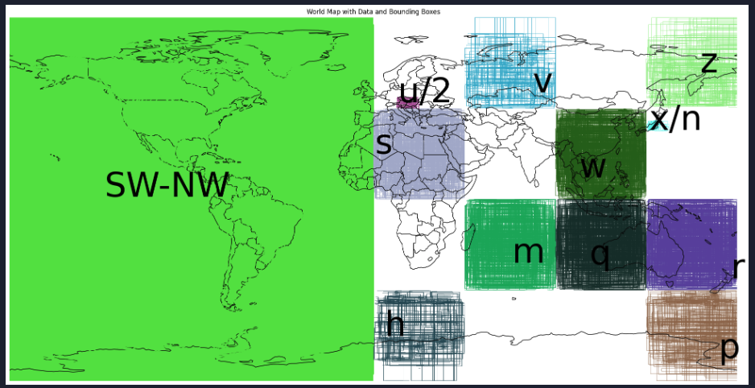

# Partitioning of Parquet files

A prototype project that partitions geoparquet files into smaller geoparquet files specific to one Geohash code.

## Overview

This project directory contains python notebooks demonstrating how to partition a parquet file spatially using [Geohash](https://en.wikipedia.org/wiki/Geohash) as the marker for partition file membership. The reason for breaking up large parquet files into smaller ones is so that a system can limit the number of files needing to be searched if a query bounding box can be supplied. The idea being to eliminate as much as posible for non-global queries.

## Running

All of these notebooks were developed and run under Visual Studio Code. There is a requirements.txt file for the third party libraries. Load these requirements into what every python instulation that is used by VSCode, which may not be the same one as defined in PATH.

## Bucket Brigade

[bucket-brigade](bucket-brigade.ipynb) was the first exploration of using geohash. It will create a dynamic number of buckets based on size. That is the bounding box is used to generate two Geohash codes which are used to define the bucket name. All similar sized records are put into those buckets.

## Bucket Brigade: Nested 
[bucket-brigade-nested](bucket-brigade-nested.ipynb) was the second attempt which derived from the findings of the first effort. This code will create a three level deep tree with nested geohash values. Records are stored in the largest bucket which can contain that record. If a record crosses over more then one geohash box, then it is stored in the parent geohash. Special buckets are used for records which fall into more then one top level geohash buckets, such as SW-NW or SE. The source data file and resulting tree for this code can be found at:

* source: s3://bigstac-duckdb-ipynb/3mil_no_global_bounds.parquet
* results: s3://bigstac-duckdb-ipynb/bucket-brigade-nested.ipynb.data.tar.gz

In the image above there is a special case SW-NW bucket which holds all the records to large to fit into one geohash box, but do not cross over the eastern half of the globe. These region buckets are not part of geohash, but geohash codes are used to calculate membership. The other 9 medium size boxes hold records which fully fit into one of those spaces. Finally there are two boxes which are sub boxes to the top levels. These also contain records which fit exclusivly to these regions. All boxes are showing every tenth record.

## Next steps

The next steps will be to create a script based off of the nested bucket code to calculate how many records will be stored in different depth trees. We need to decided if we should use 2,3,4, or 5 deap trees.

## A note about libraries

* python: pygeohash
* go: geo-traits = "0.2.0"
* rust: github.com/mmcloughlin/geohash v0.10.0

pygeohash can create acturate values for edge coordinents such as latitude=0.0 and longitude -180 with both `pgh.encode()` and `pgh.encode_strictly()` but only if using the main version and not the "lattest" version you get when you call pip install

	 pip3.10 install pygeohash # will give wrong results
	 pip3.10 uninstall pygeohash
	 pip3.10 install 'pygeohash @ git+https://github.com/wdm0006/pygeohash' # sometimes better results

Testing as found that some results are rounded incorrectly in python:

| latitude | longitude | python | go    | rust
| -------- | --------- | ------ | ----- | -----
| -90.0    | 180.0     | pbpbp  | 00000 | 00000
| 0.0      | 180.0     | xbpbp  | 80000 | 80000
| 90.0     | 180.0     | zzzzz  | 00000 | 00000

## Resources

* https://geohash.softeng.co/r - visualize geohash on the globe

---

License

Copyright © 2024 United States Government as represented by the Administrator of the National Aeronautics and Space Administration. All Rights Reserved.

Licensed under the Apache License, Version 2.0 (the "License"); you may not use this file except in compliance with the License. You may obtain a copy of the License at

http://www.apache.org/licenses/LICENSE-2.0

Unless required by applicable law or agreed to in writing, software distributed under the License is distributed on an "AS IS" BASIS, WITHOUT WARRANTIES OR CONDITIONS OF ANY KIND, either express or implied. See the License for the specific language governing permissions and limitations under the License.